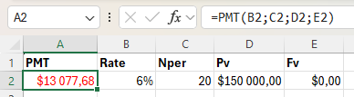

Excel-9

Project Description

Excel-9 is a guide to financial functions in Microsoft Excel. Here you'll find practical tips, instructions, and illustrations about working with them.

Table of Contents 

Financial Functions

To begin with Excel's financial functions, we consider a loan with monthly payments, an annual interest rate of 7%, a 15-year duration, a present value of $185,000 (amount borrowed) and a future value of 0 
(that's what you achieve when you pay off a loan).

We make monthly payments, so we use 7%/12 = 0.58% for Rate and 15*12 = 180 for Nper (total number of periods). 
(Note: If we make annual payments on the same loan, we use 7% for Rate and 15 for Nper.)

PMT

Result: the monthly payment equals $1,662.83.

(Note: the last two arguments are optional. Fv can be omitted (the future value of a loan equals 0).)

RATE

If Rate is the only unknown variable, we can use the RATE function to calculate the interest rate.

NPER

If Nper is the only unknown variable:

PV

If Pv is the only unknown variable:

FV

PMT examples

The PMT function in Excel calculates the payment for a loan based on constant payments and a constant interest rate. 

Consider a loan with an annual interest rate of 6%, a 20-year duration, a present value of $150,000 and a future value of 0.

Result: we make annual payments of $13,077.68.

PPMT

The PPMT function in Excel calculates the principal part of the payment. The second argument specifies the payment number.

the PPMT function above calculates the principal part of the 5th payment.

IPMT

The IPMT function in Excel calculates the interest part of the payment. The second argument specifies the payment number.

(Note: the principal part and the interest part always add up to the payment amount.)

Consider an annuity with an annual interest rate of 6% and a present value of $95,235.00 (purchase value). How much money can you withdraw at the end of each month for the next 20 years?

you make a one-time payment of $95,235.00 (negative) to pay this annuity. You'll receive 240 * $682,29 (positive) = $163,749.60 in the future. 

Investment

Assume that at the end of every year, you deposit $1000 into a savings account. At an annual interest rate of 8%, how much will your investment be worth after 10 years?

Use FV function:

In 10 years time, you pay 10 * $1000 (negative) = $10000, and you'll receive $14,486.56 (positive) after 10 years.

Compound Interest

Assume you put $10000 into a bank. How much will your investment be worth after 5 years at an annual interest rate of 8%?
Use the formula below to find out.

CAGR

There's no CAGR function in Excel. However, simply use the RRI function in Excel to calculate the compound annual growth rate (CAGR) of an investment over a period of years.

RRI

The RRI function below calculates the CAGR of an investment.

NPV

The correct NPV formula in Excel uses the NPV function to calculate the present value of a series of future cash flows and subtracts the initial investment.

For example, some Project requires an initial investment of $100.
We expect a profit of $0 at the end of the first period, a profit of $50 at the end of the second period and a profit of $150 at the end of the third period.

The discount rate equals 12%.

(Note: this is the rate of return of the best alternative investment. For example, you could also put your money in a high-yield savings account at an interest rate of 12%.)

The NPV formula below calculates the net present value of our Project.

(Note: a positive net present value indicates that the project’s rate of return exceeds the discount rate. In other words, it's better to invest your money in this Project than to put your money in a high-yield savings account at an interest rate of 12%.)

IRR

Use the IRR function in Excel to calculate a project's internal rate of return. The internal rate of return is the discount rate that makes the net present value equal to zero.

(Note: The IRR rule states that if the IRR is greater than the required rate of return, you should accept the project. IRR values are frequently used to compare investments.)

Depreciation Formulas

Excel offers five different depreciation functions. We consider an asset with an initial cost of $12,000, a salvage value (residual value) of $1000 and a useful life of 10 periods (years).

SLN

The SLN (Straight Line) function is easy. Each year the depreciation value is the same.

The SLN function performs the following calculation. Depreciation Value = (12,000 - 1,000) / 10 = 1100.00. If we subtract this value 10 times, the asset depreciates from 12,000 to 1000 in 10 years.

SYD

The SYD (Sum of Years' Digits) function is also easy. As you can see below, this function also requires the period number.

The SYD function performs the following calculations. A useful life of 10 years results in a sum of years of 10 + 9 + 8 + 7 + 6 + 5 + 4 + 3 + 2 + 1 = 55. 
The asset loses 11000 in value. Depreciation value period 1 = 10/55 * 11000 = 2000. Depreciation value period 2 = 9/55 * 11000 = 1800, etc. If we subtract these values, the asset depreciates from 12,000 to 1000 in 10 years.

DB

The DB (Declining Balance) function is a bit more complicated. It uses a fixed rate to calculate the depreciation values.

The DB function performs the following calculations. Fixed rate = 1 - ((salvage / cost) ^ (1 / life)) = 1 - (1000/12,000)^(1/10) = 1 - 0.780 = 0.22. Depreciation value period 1 = 12,000 * 0.22 = 2,640. Depreciation value period 2 = (12,000 - 2,640.00) * 0.22 = 2,059.20, etc.

DDB

The DDB (Double Declining Balance) function is easy again. However, sometimes you don't reach the salvage value when you use this function.

The DDB function performs the following calculations. A useful life of 10 years results in a rate of 1/10 = 0.1. Because this function is called Double Declining Balance we double this rate (factor = 2). Depreciation value period 1 = 12,000 * 0.2 = 2,400.00. Depreciation value period 2 = (12,000 - 2,400.00) * 0.2 = 1920.00, etc.

VDB

The VDB (Variable Declining Balance) function uses the DDB (Double Declining Balance) method by default. The 4th argument indicates the starting period, the 5th argument indicates the ending period.

The VDB function performs the same calculations as the DDB function. However, it switches to Straight Line calculation to make sure you reach the salvage value. It only switches to Straight Line calculation when Depreciation Value, Straight Line is higher than Depreciation Value, DDB.

(Note: the VDB function is much more versatile than the DDB function. It can calculate the depreciation value of multiple periods.)

Profit Margins

Assume your business had a total revenue of $10,000 in July and the cost of goods sold (COGS) equaled $4,000.

Gross Profit formula: 

Gross Profit Margin formula:

Operating Profit Margin

The operating profit margin also includes operating expenses (OPEX) such as rent, equipment, inventory costs, marketing, etc.

Operating Profit formula:

Operating Profit Margin formula:

Net Profit Margin

The net profit margin also includes non-operating expenses such as interest (on debt) and taxes.

Net Profit formula:

Net Profit Margin formula:

