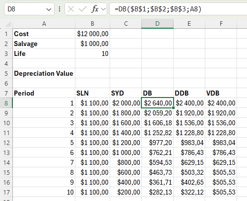
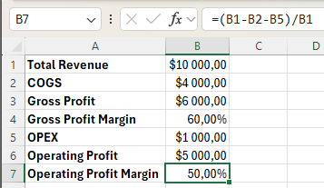

# 💸 Excel-9

---

## ✨ Project Description

**Excel-9** is a comprehensive collection and guide to financial functions in Microsoft Excel. This repository provides clear explanations, practical examples, and screenshots for each formula. Its goal is to help you understand and apply Excel's built-in financial functions for loans, investments, depreciation, and profit analysis.

> 📚 **Purpose:** Master essential Excel financial formulas for personal finance, business analysis, and academic use.

---

## 📒 Table of Contents

- [Overview](#overview)
- [Key Financial Functions](#key-financial-functions)
  - [PMT (Payment)](#pmt-payment)
  - [RATE (Interest Rate)](#rate-interest-rate)
  - [NPER (Number of Periods)](#nper-number-of-periods)
  - [PV (Present Value)](#pv-present-value)
  - [FV (Future Value)](#fv-future-value)
  - [PPMT (Principal Payment)](#ppmt-principal-payment)
  - [IPMT (Interest Payment)](#ipmt-interest-payment)
- [Advanced Scenarios](#advanced-scenarios)
  - [Compound Interest](#compound-interest)
  - [CAGR & RRI](#cagr--rri)
  - [NPV & IRR](#npv--irr)
- [Depreciation Formulas](#depreciation-formulas)
- [Profit Margins](#profit-margins)
- [Screenshots](#screenshots)
- [Further Reading & Official Links](#further-reading--official-links)
- [Requirements](#requirements)
- [Author](#author)

---

## Overview

Microsoft Excel includes a suite of financial functions designed to solve common problems related to loans, savings, investments, and asset depreciation. This repository explains how to use each function, what each parameter means, and provides annotated examples.

**Typical use cases:**
- Calculate loan payments and schedules (mortgages, car loans, etc.)
- Determine present or future value of investments
- Analyze cash flows for business decisions
- Calculate depreciation for accounting
- Compute profit margins

---

## Key Financial Functions

### PMT (Payment)

Calculates the periodic payment for a loan or investment based on constant payments and a constant interest rate.

**Syntax:**  
`=PMT(rate, nper, pv, [fv], [type])`

- `rate` – Interest rate per period (annual rate/number of periods per year).
- `nper` – Total number of payment periods.
- `pv` – Present value (principal).
- `fv` – [optional] Future value (remaining balance after last payment, usually 0).
- `type` – [optional] 0 (end of period), 1 (beginning of period).

**Example:**  
Monthly payment for a $185,000 loan, 7% annual interest, 15 years:  
`=PMT(7%/12, 15*12, -185000)`

[Official Docs: PMT](https://support.microsoft.com/en-us/office/pmt-function-0214da64-9a63-4996-bc20-214433fa6441)

---

### RATE (Interest Rate)

Returns the interest rate per period for an investment or loan.

**Syntax:**  
`=RATE(nper, pmt, pv, [fv], [type], [guess])`

**Example:**  
Find the interest rate for a loan with known payment, periods, and present value.

[Official Docs: RATE](https://support.microsoft.com/en-us/office/rate-function-9f665657-4a7e-4bb7-a030-83fc7b1c44b4)

---

### NPER (Number of Periods)

Returns the number of payment periods for an investment or loan.

**Syntax:**  
`=NPER(rate, pmt, pv, [fv], [type])`

**Example:**  
Find the number of periods.

[Official Docs: NPER](https://support.microsoft.com/en-us/office/nper-function-948cdf64-9e4d-4c7c-8d3d-e273f8f1a5d8)

---

### PV (Present Value)

Returns the present value of an investment or loan.

**Syntax:**  
`=PV(rate, nper, pmt, [fv], [type])`

**Example:**  
Here its the ammount we borrowed.

[Official Docs: PV](https://support.microsoft.com/en-us/office/pv-function-23879d31-0e02-4321-be01-da16e8168cbd)

---

### FV (Future Value)

Calculates the future value of an investment based on periodic, constant payments and a constant interest rate.

**Syntax:**  
`=FV(rate, nper, pmt, [pv], [type])`

**Example:**  
Future value of monthly investments.

[Official Docs: FV](https://support.microsoft.com/en-us/office/fv-function-3a7c2c97-4fdd-4d9d-8d7b-c6b5adf6c1b6)

---

### PPMT (Principal Payment)

Returns the payment on the principal for a given period.

**Syntax:**  
`=PPMT(rate, per, nper, pv, [fv], [type])`

- `per` – Specific period for the calculation.

**Example:**  
Principal paid in the 5th year of a loan.

[Official Docs: PPMT](https://support.microsoft.com/en-us/office/ppmt-function-0214da64-9a63-4996-bc20-214433fa6441)

---

### IPMT (Interest Payment)

Returns the interest payment for a specific period.

**Syntax:**  
`=IPMT(rate, per, nper, pv, [fv], [type])`

**Example:**  
Interest paid in the 5th year of a loan.

[Official Docs: IPMT](https://support.microsoft.com/en-us/office/ipmt-function-0214da64-9a63-4996-bc20-214433fa6441)

(Note: the principal part and the interest part always add up to the payment amount.)

---

## Advanced Scenarios

### Compound Interest

Calculate the result of compounding interest over multiple periods.

**Formula:**  
`=Principal * (1 + rate/nper)^(nper*years)`

**Example:**  
Future value of $10,000 invested at 8% compounded annually for 5 years.

[More: Compound Interest in Excel](https://support.microsoft.com/en-us/office/calculate-compound-interest-in-excel-62f0b753-8bfa-4e35-82c7-1a7776e9e5e3)

---

### CAGR & RRI

#### RRI (Equivalent Interest Rate)

Returns the equivalent interest rate for the growth of an investment.

**Syntax:**  
`=RRI(nper, pv, fv)`

- `nper` – Number of periods
- `pv` – Present value (negative)
- `fv` – Future value

**CAGR (Compound Annual Growth Rate):**  
The CAGR measures the growth of an investment as if it had grown at a steady rate on an annually compounded basis. 

**Example:**  
Annual rate needed for $10,000 to grow to $14,693.28 in 5 years.

[Official Docs: RRI](https://support.microsoft.com/en-us/office/rri-function-9743f2d3-5cce-4b1d-aa42-2f7b2e7da37a)

---

### NPV & IRR

#### NPV (Net Present Value)

Calculates the net present value of an investment based on a discount rate and future cash flows.

**Syntax:**  
`=NPV(rate, value1, [value2], ...)`

**Note:** Subtract initial investment separately.

**Example:**  
Discount rate 12%, Cash flows: Period 0: -100, Period 1: 0, Period 2: 50, Period 3: 150. 

[Official Docs: NPV](https://support.microsoft.com/en-us/office/npv-function-8672cb67-2576-4b67-99cd-911d0a96614c)

#### IRR (Internal Rate of Return)

Calculates the internal rate of return for a series of cash flows.

**Syntax:**  
`=IRR(values, [guess])`

[Official Docs: IRR](https://support.microsoft.com/en-us/office/irr-function-64925eaa-9988-495b-b290-3ad0c163c1bc)

(Note: The IRR rule states that if the IRR is greater than the required rate of return, you should accept the project. IRR values are frequently used to compare investments.)

---

## Depreciation Formulas

Excel supports several depreciation methods for fixed assets:

- **SLN (Straight Line):** Equal amount each year  
  `=SLN(cost, salvage, life)`  
    
  [Docs: SLN](https://support.microsoft.com/en-us/office/sln-function-39f43d4b-2c59-4b4f-8b8a-3b0a1a2ab6e9)

- **SYD (Sum-of-Years' Digits):** Accelerated depreciation  
  `=SYD(cost, salvage, life, period)`  
    
  [Docs: SYD](https://support.microsoft.com/en-us/office/syd-function-9971d6b7-4370-4d8b-8f7a-3f5b5a6c8b95)

- **DB (Fixed Declining Balance):**  
  `=DB(cost, salvage, life, period, [month])`  
    
  [Docs: DB](https://support.microsoft.com/en-us/office/db-function-28366b94-09eb-4a84-9da8-63f3e417f611)

- **DDB (Double Declining Balance):**  
  `=DDB(cost, salvage, life, period, [factor])`  
    
  [Docs: DDB](https://support.microsoft.com/en-us/office/ddb-function-71b0339c-cabe-4b8e-8ecc-98cfa5d735c7)

- **VDB (Variable Declining Balance):**  
  `=VDB(cost, salvage, life, start_period, end_period, [factor], [no_switch])`  
    
  [Docs: VDB](https://support.microsoft.com/en-us/office/vdb-function-1e88b8c5-ef50-4b5f-9d0e-b42a36ae8d83)

---

## Profit Margins

Analyze your business's profitability using these formulas:

- **Gross Profit:** Revenue – Cost of Goods Sold  
  
- **Gross Profit Margin:** (Gross Profit / Revenue)  
  
- **Operating Profit:** Gross Profit – Operating Expenses  
  
- **Operating Margin:** (Operating Profit / Revenue)  
  
- **Net Profit:** Operating Profit – Taxes – Interest – Other Expenses  
  
- **Net Margin:** (Net Profit / Revenue)  
  

[Profit Margin Basics](https://corporatefinanceinstitute.com/resources/accounting/profit-margin/)

---

## Screenshots

Visual step-by-step examples for each formula are provided in the `/Screenshots` folder.

---

## Further Reading & Official Links

- [Microsoft Excel Financial Functions – Full Reference](https://support.microsoft.com/en-us/excel)
- [Microsoft Excel Functions by Category](https://support.microsoft.com/en-us/office/excel-functions-by-category-5f91f4e9-7b42-46d2-9bd1-63f26a86c0eb)
- [Excel Video Tutorials by Microsoft](https://support.microsoft.com/en-us/office/excel-video-training-9bc05390-e94c-46af-a5b3-d7c22f6990bb)

---

## Requirements

- Microsoft Excel (2013 or later recommended for full function support)
- Basic understanding of finance/math is helpful

---

## Author

Repository and documentation by **[Kuba27x](https://github.com/Kuba27x)**  
[Excel-9 on GitHub](https://github.com/Kuba27x/Excel-9)

---
